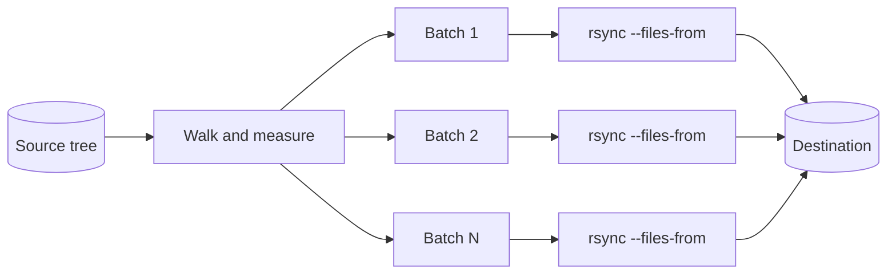

<div align="center">

# rgigasync

**Mirror enormous directory trees with `rsync` — by splitting the transfer into bounded batches.**

[](https://github.com/jbelke/rgigasync/actions/workflows/rust.yml)
[](https://codecov.io/gh/jbelke/rgigasync)
[](LICENSE)
[](https://www.rust-lang.org)

</div>

---

`rgigasync` walks the source tree itself, slices it into size-bounded batches, and hands
each batch to `rsync` as an explicit `--files-from` list. A batch that fails is retried on
its own rather than restarting the run, batches can transfer concurrently, and each `rsync`
invocation only ever sees its own slice of the tree.

It is a wrapper, not a reimplementation — every `rsync` flag you already know still works.

## When this helps — and when it doesn't

> [!IMPORTANT]
> **Modern `rsync` is better than its reputation.** Since 3.0.0, `rsync -r` uses
> *incremental recursion* by default whenever both ends run 3.0.0 or newer — it no longer
> builds the whole file list up front, so it already uses far less memory and starts
> transferring quickly. If you are running a recent `rsync` on both ends and none of the
> conditions below apply, plain `rsync` is probably all you need.

`rgigasync` earns its place in four situations:

| Situation | What batching changes |
| --- | --- |
| **Unreliable link** | A drop costs one batch, not the whole tree. Plain `rsync` restarts the transfer. |
| **Latency-bound transfer** | `--parallel` runs several `rsync` processes at once; a single `rsync` is one process. |
| **Incremental recursion unavailable** | Each invocation still only sees its own batch, so the full-file-list cost never returns. |
| **Trees that trip rsync's edge cases** | Empty directories, symlinks, and newlines in filenames are enumerated explicitly. |

Incremental recursion is **off** — and rsync's full-file-list memory cost comes back — when:

- either end runs `rsync` older than 3.0.0, **including macOS's `/usr/bin/rsync`**, which
  is `openrsync` advertising 2.6.9 compatibility;
- you pass `--no-inc-recursive`;
- you pass an option that requires the complete list: `--delete-before`, `--delete-after`,
  `--prune-empty-dirs`, `--delay-updates`, or a per-directory filter file.

> [!NOTE]
> **This is not a benchmark claim.** Nothing here measures `rgigasync` as *faster* than a
> plain `rsync -aAX`, and no such benchmark is offered. What batching changes is restart
> granularity, concurrency, and which edge cases are handled correctly — not throughput.

## How it works



1. **Walk** the source tree, recording each path and its size.
2. **Accumulate** paths until the running total reaches the batch size (default 256 MiB).
3. **Write** that batch to a temporary `--files-from` list and invoke `rsync` on it.
4. **Retry** a failed batch — up to 5 attempts by default — unless the failure is
   deterministic, in which case it gives up immediately.
5. Repeat until the tree is exhausted.

Because each `rsync` invocation is handed an explicit list, it never has to discover the
tree for itself.

### A note on memory

The bounded thing is **`rsync`'s per-invocation file list**, not `rgigasync`'s own
footprint. `rgigasync` materialises every entry in the tree before the first `rsync`
spawns — on the order of a gigabyte of RSS per 10 million entries.

That is a deliberate trade, not an oversight: knowing the whole tree up front is what buys
deterministic, testable batch boundaries and lets `--parallel` schedule batches
concurrently. If your constraint is the memory of the *scanning* process rather than of
`rsync`, this is the wrong tool.

## Requirements

- **`rsync` 3.x** on your `PATH` — `rgigasync` drives it, it does not replace it.
- **Rust 1.74+** and Cargo, to build.
- **Linux or macOS.**

> [!WARNING]
> **On macOS, `/usr/bin/rsync` is not rsync.** It is `openrsync` (advertising itself as
> "rsync version 2.6.9 compatible"), and it does not support `--xattrs` or `--acls` — so
> extended attributes, ACLs and resource forks are dropped without an error. Install a real
> rsync and make sure it comes first on your `PATH`:
> ```bash
> brew install rsync
> rsync --version | head -1     # want 3.x, not "openrsync"
> ```
> If you cannot change `PATH`, point `rgigasync` straight at the binary instead:
> `RGIGASYNC_RSYNC=/opt/homebrew/bin/rsync`. See
> [Preserving macOS metadata](#preserving-macos-metadata) for the flags to pass.

## Installation

Build from source and put the binary somewhere on your `PATH`.

```bash
git clone https://github.com/jbelke/rgigasync.git
cd rgigasync
cargo build --release
```

The binary lands at `target/release/rgigasync`. Then pick one:

<details>
<summary><b>Option 1 — install into <code>/usr/local/bin</code></b> (already on <code>PATH</code> for most shells)</summary>

```bash
sudo mkdir -p /usr/local/bin          # macOS may not have it
sudo cp target/release/rgigasync /usr/local/bin/
```

</details>

<details>
<summary><b>Option 2 — install into <code>~/.local/bin</code></b> (no <code>sudo</code>)</summary>

```bash
mkdir -p ~/.local/bin
cp target/release/rgigasync ~/.local/bin/
```

If `~/.local/bin` is not already on your `PATH`, add it to your shell profile:

```bash
# ~/.zshrc, or ~/.bashrc for bash
export PATH="$HOME/.local/bin:$PATH"
```

</details>

<details>
<summary><b>Option 3 — install straight from git with Cargo</b></summary>

```bash
cargo install --git https://github.com/jbelke/rgigasync
```

Installs into `~/.cargo/bin`, which the Rust installer already adds to your `PATH`.

</details>

Verify it worked:

```bash
rgigasync --version
```

## Usage

```
rgigasync [OPTIONS] -- "<RSYNC_OPTIONS>" <SOURCE> <DESTINATION> [BATCH_SIZE_MB]
```

> [!TIP]
> The `--` is optional, but use it anyway. It marks everything after it as positional,
> so an rsync flag can never be captured by `rgigasync` instead — and the two programs
> genuinely share spellings: `--dry-run` and `--quiet` mean different things to each.
> Any `rgigasync` flag must come *before* the `--`.

```bash
rgigasync -- "-av --info=progress2" /Volumes/SrcDir/ /Users/you/DestDir/
```

### Positional arguments

| Argument         | Required | Default | Description                                                                 |
| ---------------- | :------: | :-----: | --------------------------------------------------------------------------- |
| `RSYNC_OPTIONS`  |    yes   |    —    | Quoted string of flags passed through to `rsync` verbatim.                    |
| `SOURCE`         |    yes   |    —    | Source directory to mirror. Must be local, so it can be enumerated.           |
| `DESTINATION`    |    yes   |    —    | Destination. May be `[user@]host:/path` or `rsync://…`.                       |
| `BATCH_SIZE_MB`  |    no    |  `256`  | Target size of each batch, in MiB. See [Tuning](#tuning) below.               |

### Options

| Flag                      | Default        | Description                                                              |
| ------------------------- | -------------- | ------------------------------------------------------------------------ |
| `--parallel`              | off            | Run batches concurrently instead of one after another.                    |
| `--jobs <N>`              | one per core   | Concurrent `rsync` processes. Only meaningful with `--parallel`.          |
| `--max-files-per-batch <N>` | `0` (no cap) | Cap entries per batch. The knob that bounds `rsync` on trees of tiny files. |
| `--dry-run`               | off            | Scan and plan batches, printing the `rsync` commands without running them. |
| `--retries <N>`           | `5`            | Attempts per batch, including the first.                                  |
| `--retry-delay <SECONDS>` | `90`           | Seconds to wait between attempts.                                         |
| `-q`, `--quiet`           | off            | Only report errors.                                                       |

> [!NOTE]
> `--dry-run` is `rgigasync`'s, not rsync's. It prints the planned `rsync` invocations
> and exits without spawning any. To use *rsync's* dry run instead, put `--dry-run`
> inside the quoted options string, where it is forwarded through.

> [!NOTE]
> **Retries are for flaky networks, not bad arguments.** `rsync` exit codes that mean
> "this can never succeed" — `1` (syntax or usage), `2` (protocol incompatibility) and
> `4` (action not supported) — fail straight away and are reported as `not retryable`.
> Otherwise a mistyped flag would cost `--retries` × `--retry-delay` before telling you
> about the typo: seven and a half minutes at the defaults. Exit `24` (files vanished
> mid-transfer) is treated as success with a warning, since that is routine on a live tree.

### Exit codes

| Code | Meaning                                                       |
| :--: | ------------------------------------------------------------- |
| `0`  | Everything transferred.                                        |
| `1`  | Transfer finished, but some entries were unreadable and skipped. |
| `2`  | Invalid arguments, source, or destination.                     |
| `3`  | `rsync` failed after all retries.                              |

### Environment variables

Read from the environment, or from a `.env` file in the **current working directory**.
A sample lives at [`src/.env`](src/.env).

| Variable                           | Default   | Description                                                    |
| ---------------------------------- | --------- | -------------------------------------------------------------- |
| `RGIGASYNC_RSYNC`                  | `rsync`   | Which `rsync` binary to run. Useful for pinning a real rsync over macOS's `openrsync`. |
| `RGIGASYNC_NUM_THREADS`            | `0`       | Worker threads for `--parallel`. `0` uses every available core. |
| `RGIGASYNC_FILE_FEEDBACK_COUNT`    | `1000000` | Print a progress line every N entries.                          |
| `RGIGASYNC_TIME_FEEDBACK_INTERVAL` | `120`     | Print a progress line at least every N seconds.                 |
| `RGIGASYNC_RETRIES`                | `5`       | Attempts per batch, including the first.                        |
| `RGIGASYNC_RETRY_DELAY_SECS`       | `90`      | Seconds to wait between attempts.                               |

Command-line flags win over the environment. `RAYON_NUM_THREADS`, `FILE_FEEDBACK_COUNT`
and `TIME_FEEDBACK_INTERVAL` are still honoured as legacy names for the three settings
that had them, but prefer the `RGIGASYNC_`-prefixed spellings in new setups.

## Examples

```bash
# Archive mode, verbose, with a live progress meter
rgigasync -- "-av --info=progress2" /Volumes/SrcDir/ /Users/you/DestDir/
```

<details>
<summary><b>More examples</b></summary>

**Resume a partial copy — skip anything already at the destination**

```bash
rgigasync -- "-av --ignore-existing --info=progress2" /Volumes/SrcDir/ /Users/you/DestDir/
```

**Larger batches for a tree of big files**

```bash
rgigasync -- "-av --info=progress2" /Volumes/SrcDir/ /Users/you/DestDir/ 512
```

**Exclude patterns** — quoting matters; the options string is split like a shell would.

```bash
rgigasync -- "-av --exclude='*.tmp' --exclude='*.log'" /Volumes/SrcDir/ /Users/you/DestDir/
```

**Over SSH, compressed**

```bash
rgigasync -- "-avz -e ssh" /Volumes/SrcDir/ user@remote-server:/home/user/DestDir/
```

**Cap the bandwidth at 10 MB/s**

```bash
rgigasync -- "-av --bwlimit=10240" /Volumes/SrcDir/ /Users/you/DestDir/
```

**Dry run — preview without writing anything**

```bash
rgigasync -- "-av --dry-run" /Volumes/SrcDir/ /Users/you/DestDir/
```

**Parallel, all cores, 2 GiB batches**

```bash
rgigasync --parallel -- "-av --ignore-existing --info=progress2" /Volumes/SrcDir/ /Users/you/DestDir/ 2048
```

**Parallel, pinned to 4 concurrent transfers**

```bash
rgigasync --parallel --jobs 4 -- "-av --info=progress2" /Volumes/SrcDir/ /Users/you/DestDir/ 2048
```

**Plan without transferring** — prints the `rsync` commands it would run, then exits

```bash
rgigasync --dry-run -- "-av" /Volumes/SrcDir/ /Users/you/DestDir/
```

</details>

## Tuning

**Batch size** is the main dial, and it trades startup latency against per-invocation overhead.

| Tree shape                          | Try              | Why                                                                |
| ----------------------------------- | ---------------- | ------------------------------------------------------------------ |
| Millions of small files             | `256`–`512`      | Keeps each `rsync` file list small; that is the whole point.        |
| Media libraries, VM images, backups | `2048`–`8192`    | Fewer `rsync` invocations; per-process overhead stops dominating.   |
| Slow or flaky link                  | lower            | A failed batch costs less to retry.                                 |

> [!NOTE]
> Batch size is measured against **source bytes scanned**, not bytes actually transferred.
> On a mostly-synced tree, `rsync` will skip most of a batch, so batches complete far
> faster than their nominal size suggests.

**Parallelism** helps most when transfers are latency-bound — many small files, or a
remote destination — and helps least when you are already saturating a disk or a link.
Start with `--parallel` unbounded, then pin `--jobs N` if the target starts thrashing.

## Caveats

> [!WARNING]
> **`--delete` is rejected, by design.** Passing it — or `--del`, `--delete-before`,
> `--delete-during`, `--delete-delay`, `--delete-after`, `--delete-excluded`, or
> `--delete-missing-args` — exits `2` with a diagnostic rather than running.
>
> It cannot work here, and the reason is structural: `--files-from` disables recursion, and
> `rsync` only deletes inside directories it recurses into. Passed through, it would be a
> silent no-op — you would believe you had a mirror and actually have an append-only copy,
> with stale files living at the destination forever. Failing loudly is the safer answer.
>
> If you need deletions, make a separate pass over the whole tree once the sync completes:
> ```bash
> rsync -a --delete /Volumes/SrcDir/ /Users/you/DestDir/
> ```

### Preserving macOS metadata

`-a` does **not** imply `--xattrs` or `--acls`. On macOS that means a plain `-av` run
silently discards extended attributes, ACLs, and resource forks — the copy looks complete
and byte-identical, and `rsync -an --itemize-changes` will not flag the loss either.

For a fidelity-preserving mirror, ask for the metadata explicitly:

```bash
rgigasync -- "-avHAX --fileflags --crtimes --info=progress2" /Volumes/SrcDir/ /Users/you/DestDir/
```

`--fileflags` and `--crtimes` need rsync 3.2+; `-A`/`-X` need a real rsync, not the
`openrsync` at `/usr/bin/rsync`. If you are archiving irreplaceable data and do not need
batching, `ditto --rsrc --extattr --acl` remains the highest-fidelity option on macOS.

A few other things worth knowing:

- **Symlinks are copied as links, never followed.** The link is recreated at the
  destination; its target is not chased or duplicated.
- **Unreadable entries are skipped, not fatal.** A permission-denied subdirectory
  produces a warning and the run continues — a multi-hour sync should not die on one file.
- **Options are split like a shell splits them**, so `--exclude='*.tmp'` behaves the way
  you would expect at a prompt rather than being passed through with literal quotes.

## Development

```bash
cargo build              # debug build
cargo test               # run the test suite
cargo clippy --all-targets   # lints (pedantic is on)
cargo fmt --check        # formatting
cargo tarpaulin --out Xml    # coverage, as CI runs it
```

The crate forbids `unsafe_code` and runs `clippy::pedantic` as warnings — see the
`[lints]` section of [`Cargo.toml`](Cargo.toml).

## Contributing

Issues and pull requests are welcome. Keep changes focused, make sure `cargo test` and
`cargo clippy` are clean, and describe what you observed rather than only what you changed.

## License

[MIT](LICENSE) © Josh Belke
